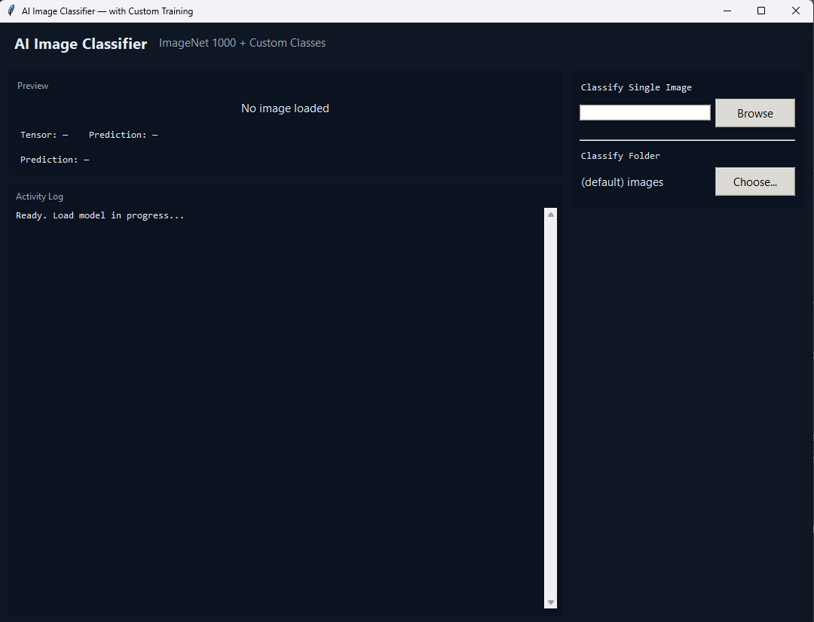

# 🖼️ AI Image Classifier (PyTorch + Tkinter)

A graphical AI Image Classifier built with Python, PyTorch, and Tkinter.  
It supports ImageNet-based prediction as well as custom training on user-defined image classes.

---

## ✨ Features

### 🧠 AI Functionality
- Uses pretrained ResNet-18 backbone (ImageNet-ready)
- Custom classifier head for user-defined training
- Feature extraction-based training (fast + lightweight)
- Confidence-based prediction output (%)
- Supports multiple image classes with local dataset folders

### 🏋️ Training System
- Add custom classes via GUI
- Train directly inside the application
- Automatic dataset loading from folders
- Saves trained model locally (custom_head.pth)
- Persistent class mapping (custom_classes.json)

### 🖼️ Image Support
- JPG / JPEG
- PNG
- BMP
- GIF
- Automatic preprocessing (resize + normalization)
- Batch folder processing support

### 🧩 Graphical User Interface (GUI)
- Built with Tkinter + ttk
- Modern dark-themed interface
- Image preview panel
- Activity log console (live updates)
- Prediction display (class + confidence %)
- Folder selector + file browser
- Training control panel (add / remove / train)

---

## 🛠 Technologies Used

- Python 3
- PyTorch
- torchvision
- PIL (Pillow)
- Tkinter / ttk
- threading
- json / os / pathlib

---

## ▶️ How to Run

1. Make sure Python 3 is installed  
2. Install dependencies: pip install torch torchvision pillow  
3. Run the program: python main.py  

---

## 📂 Required Files

- main.py  
- custom_classes/ (auto-created for datasets)  
- custom_classes.json (auto-generated)  
- custom_head.pth (created after training)  
- images/ (optional default folder)

---

## ⚠️ Notes

- First run loads pretrained backbone automatically  
- At least 2 classes are required before training  
- Model quality depends on dataset size and variation  
- Designed for learning and experimentation with CNN pipelines  

---

## 👤 Author

AlexIsNotInset
